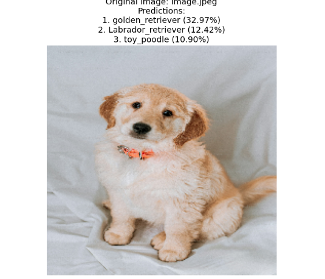
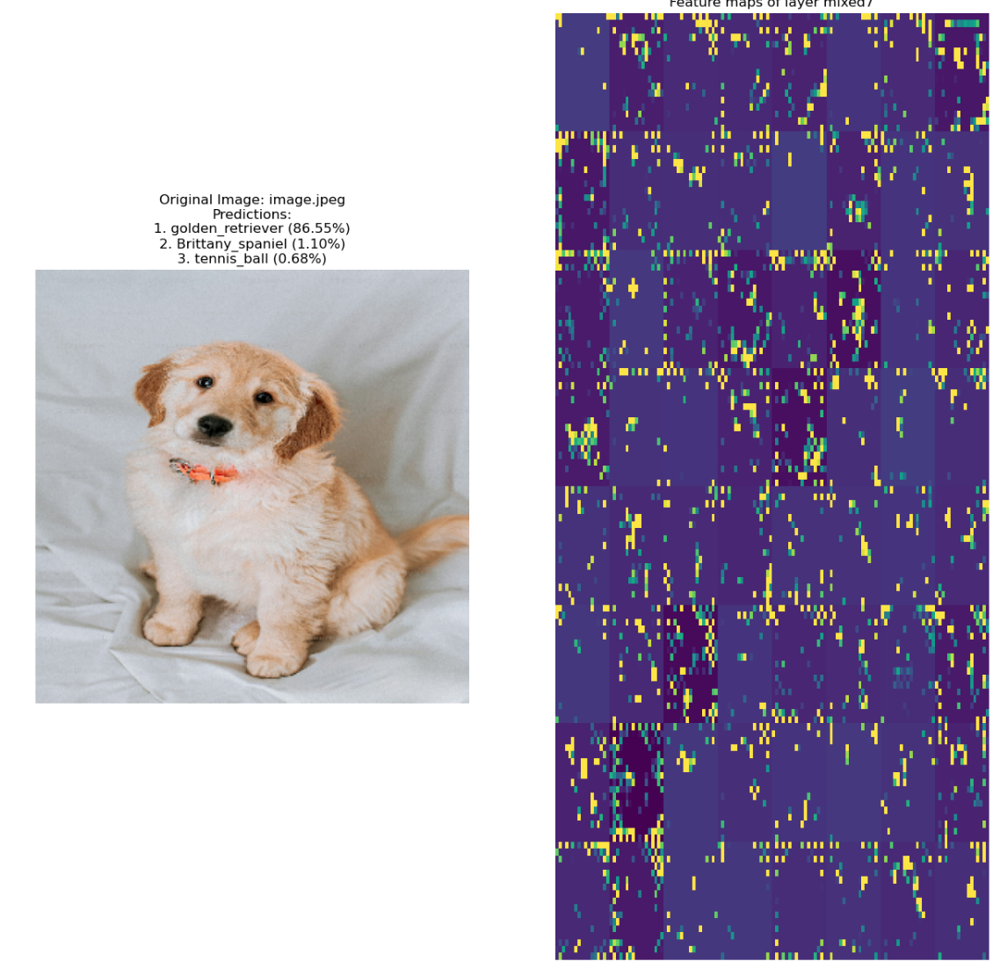

# deepviz-inceptionv3
# Feature Map Visualization with InceptionV3

This project visualizes the feature maps learned by the **InceptionV3** convolutional neural network, using the Keras library in TensorFlow. Feature maps help us interpret what a model "sees" and focuses on when making predictions, offering insights into each layer’s learned representations.

## Overview

Feature maps in a convolutional neural network represent how filters respond to different parts of an image. This project:
- Uses **InceptionV3** (pretrained on ImageNet) from `keras.applications`.
- Loads an image, processes it, and visualizes the output from various convolutional layers.
- Provides visual insight into what each filter in a layer responds to, such as edges, textures, or shapes.

## Requirements

- **Python 3.6+**
- **TensorFlow** (with Keras API)
- **NumPy**
- **Matplotlib**

## Results

The script produces a plot with:

- Original Image: Displayed at the top with the top three predictions and their confidence scores.
- Feature Maps: Grids of feature maps extracted from each specified convolutional layer (e.g., block1_conv2, block2_conv2, etc.) in VGG16.

## Example Output

### Original Image with Predictions

The model’s top three predictions for the input image (e.g., a dog photo) are displayed with confidence scores:

- Golden Retriever (32.97%)
- Labrador Retriever (12.42%)
- Toy Poodle (10.90%)

### Feature Maps from VGG16 Layers
Feature maps for each selected layer, showing how the model detects various patterns at different depths. These include basic shapes, textures, and high-level details as the layers progress.

## Conclusions

-  Model Performance: The predictions indicate that the VGG16 model is able to recognize and classify dog breeds with reasonable accuracy. The confidence for "Golden Retriever" is the highest, which is consistent with the visual characteristics of the input image.

-  Layer Analysis: The feature maps show that:

      - Early Layers (e.g., block1_conv2): Capture basic shapes and edges, which are fundamental patterns in the image.
      - Middle Layers (e.g., block2_conv2, block3_conv3): Capture textures and more complex shapes, focusing on specific parts of the image.
      - Deeper Layers (e.g., block4_conv3, block5_conv3): Identify high-level, abstract features that contribute to object classification. These layers focus on refined patterns, highlighting parts relevant to breed identification.

-  Interpretability: This visualization of feature maps helps in understanding how VGG16 builds its understanding of an image from simple edges and textures to high-level abstract representations, which are essential for classification tasks. This step-by-step visualization confirms that each layer progressively refines the image’s detail, which ultimately helps in making accurate predictions.

